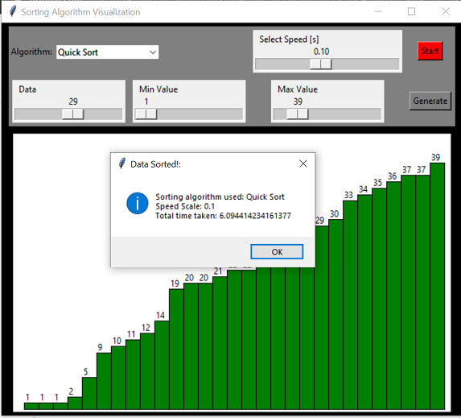

# Collection-of-Algorithm-Visualizations
Working of algorithms visualised. Using Tkinter, Networkx and Matplotlib.

## Sort Visualizer 

Visualizes different sorting Algorithms

## Sudoku solver 

Uses a backtracking algorithm and the GUI visualizes how it works!

##Travelling Salesman Output graph Visualization

## Single-source shortest path problem (Otpimized Path output)  using Networkx and Matplotlib

